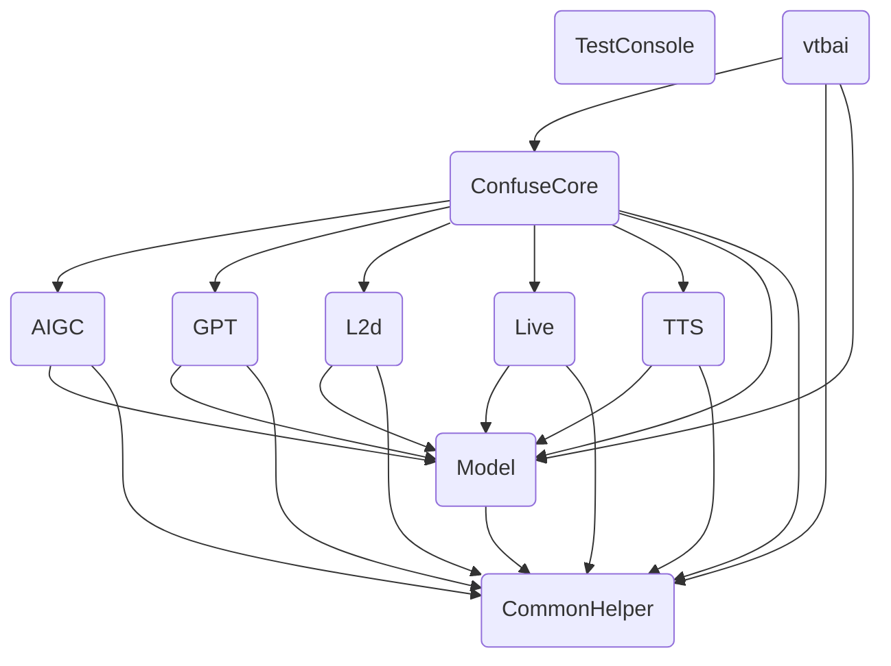

# python 版本 
若 C# 版本（Docker）不稳定或者不能使用，请使用下面版本，并阅读 Source 中的 Readme
https://github.com/newreport/vtbai/releases/tag/1.1-py


# Docker 版本

```bash
docker run -d --restart=always --name vtbai -p 3939:3939 -v vtbai-data:/data newreport/vtbai
```
|功能|地址|
|---|---|
|swagger 后端 api 列表|http://127.0.0.1:3939/swagger|
|obs弹幕(api 方式，固定 0.1s 刷新一次)|http://127.0.0.1:3939/static/subtitle_api.html|
|obs弹幕(websocket)|http://127.0.0.1:3939/static/subtitle_websocket.html|


# 架构
blivedm（抓直播间信息）——>openai（猫娘对话）——>vits（tts 文本转语音）——>vts（语音转口型，快捷键触发表情）——>obs(推流)

> 从直播间抓取弹幕和礼物/SC，接收后发送 gpt，等待 gpt 回调消息后进行 tts 推理，然后根据关键字或者情感推理使用 VTS API 触发表情和 playsound 播放语音， 播放时 vts（需在 VTS 中进行配置） 根据声音匹配口型

> 除非公司或大佬，非常不建议手搓 live2d，一是耗时，二是 vts 配合 api 触发表情快捷键直播效果还可以  

>  本流程仅在 docker 下测试并通过，理论 OS 系统一样适用，但安装麻烦这里不做部署教程


## 功能
- 支持 api 扩展 gpt 和 tts，扩展见swagger
- 支持自定义优先级队列

##  编写中...
- 抖音支持
- VTS API 关键字触发表情
- 语句情感推断触发 VTS 表情
- Azure API TTS 
- Link CharacterAI 角色扮演最好的 AI
- Multi link 联动
- ChatGLM-6B 本地1
- ChatterBot 本地2
- Twitch & Youtube 平台支持


## 注意事项
> 关于鉴权，所有请求均为了方便使用和调试均为 get，此项目一般在本地跑不会做任何鉴权。需要鉴权请用 nginx/[nginx proxy manager](https://nginxproxymanager.com/) 添加信任用户。或者用 [frp](https://github.com/fatedier/frp)/ [nps](https://github.com/ehang-io/nps) 内穿到本地使用

## 二次开发

* TestConsole 测试用终端，和程序无关
* vtbai 主程序，提供api接口
  * ConfuseCore 核心程序，引用所有模块
    * AIGC
    * GPT
    * L2d
    * Live
    * TTS
      * Model
        * CommonHelper


## 参考了以下资源
- [vits](https://github.com/jaywalnut310/vits) vits source
- [MoeGoe](https://github.com/CjangCjengh/MoeGoe.git) vits chinese
- [vits_with_chatgpt-gpt3](https://github.com/Paraworks/vits_with_chatgpt-gpt3) tts 推理参考
- [blivedm](https://github.com/xfgryujk/blivedm/tree/master) 抓取 b 站直播间信息
- [演示模型](https://huggingface.co/newreport/live_tts_default_model/tree/main) vits model (商用请自炼自然人同意的合法声源或用 Azure)


## 开发环境
> 编译器：VSCode、VS

> 主机：itx，仅 openai 模式 cpu tts 推理下可用
- CPU：5700G
- GPU：核显
- 主板：华硕 B550m TUF PLUS WIFI
- 硬盘：铠侠 RC20
- 内存：32*4（3133hz 金百达）
- 电源：台达 300W
- 机箱：X40 5.5L

## 生产环境
- CPU：5900X
- GPU：3060 12G
- 主板：华硕 B550m TUF PLUS WIFI Ⅱ
- 硬盘：三星 980pro
- 内存：16*4（3133hz 金百达）
- 电源：先马黑钻 1000W
- 机箱：长城阿基米德7


]
